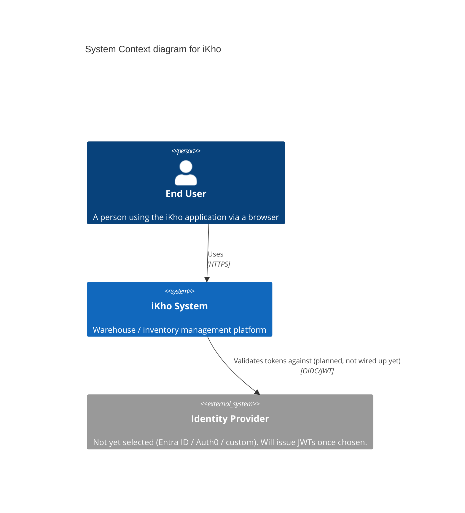
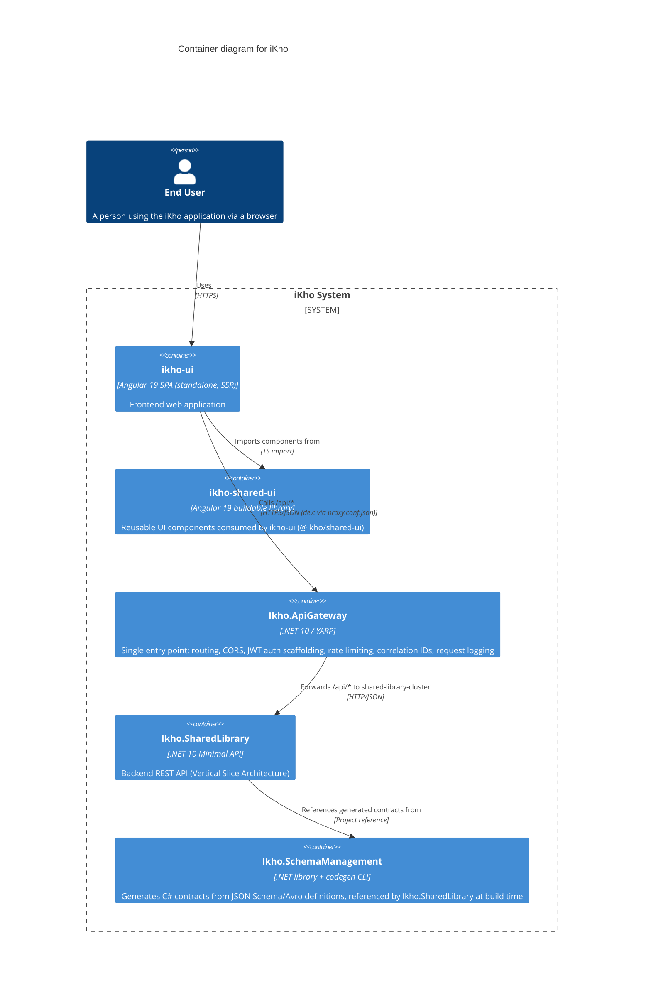
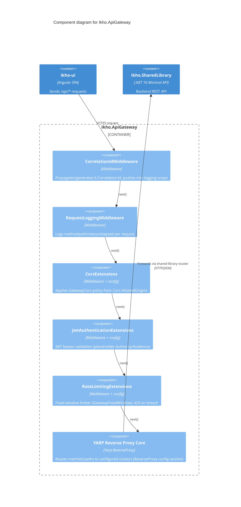

# iKho Architecture

> **Start here.** This is the entry point for understanding how the iKho system fits
> together. Diagrams use the [C4 model](https://c4model.com/) (Context → Container →
> Component) rendered with Mermaid. Keep this document up to date as containers/components
> are added or change — it is the map new team members use to orient themselves.

## How to read this doc

| Level | Diagram | Shows |
|---|---|---|
| 1 | [System Context](#1-system-context) | iKho as a black box and who/what interacts with it |
| 2 | [Container](#2-container-diagram) | The deployable apps/services that make up iKho and how they talk to each other |
| 3 | [Component](#3-component-diagrams) | The internals of an individual container |

Detailed, container-specific docs live alongside this file (e.g.
[api-gateway.md](./api-gateway.md)) — link them from the relevant section below as they're
written.

## 1. System Context

- The **Identity Provider** is aspirational — the API Gateway has JWT validation scaffolding
  in place, but no provider has been selected yet (see
  [api-gateway.md § Open questions](./api-gateway.md#open-questions)).

## 2. Container Diagram

| Container | Path | Port(s) |
|---|---|---|
| `ikho-ui` | [source/apps/ikho-ui](../../source/apps/ikho-ui) | 4200 (dev) |
| `ikho-shared-ui` | [source/libs/ikho-shared-ui](../../source/libs/ikho-shared-ui) | — (library, not deployed standalone) |
| `Ikho.ApiGateway` | [source/apps/ikho-api-gateway](../../source/apps/ikho-api-gateway) | 5080 / 7080 |
| `Ikho.SharedLibrary` | [source/libs/ikho-shared-library](../../source/libs/ikho-shared-library) | 5143 / 7270 |
| `Ikho.SchemaManagement` | [source/libs/ikho-schema-management](../../source/libs/ikho-schema-management) | — (build-time codegen, not a running service) |

## 3. Component Diagrams

### 3.1 Ikho.ApiGateway

Full detail: [api-gateway.md](./api-gateway.md).

### 3.2 Ikho.SharedLibrary

Not yet implemented beyond a template `Program.cs` — no feature slices exist yet. Once
features are added under `Features/{Feature}/` (per
[csharp.instructions.md](../../.github/instructions/csharp.instructions.md)), add a component
diagram here showing the endpoint/service/repository slices.

## Adding a new container or component

When adding a new deployable app/service:

1. Add it to the **Container Diagram** above with its relationships to existing containers.
2. If it has non-trivial internals (multiple middleware/services worth documenting), add a
   **Component Diagram** under [§3](#3-component-diagrams).
3. If it warrants deeper documentation (config reference, ports, decisions), create a
   sibling doc (e.g. `docs/architecture/<container-name>.md`) and link it from the relevant
   row/section here.
4. Keep this file as the single jumping-off point — don't let container-specific detail pile
   up here; push it into the linked docs instead.

## Related documents

- [api-gateway.md](./api-gateway.md) — API Gateway deep dive (config, pipeline, open questions)
- [docs/plans](../plans) — implementation plans for past/in-flight features
- [.github/copilot-instructions.md](../../.github/copilot-instructions.md) — repo-wide conventions for AI agents (and a useful quick-start for humans too)
