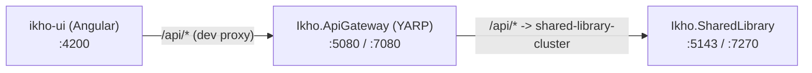

# API Gateway Architecture

> Living document — update this whenever the gateway's topology, config sections, or
> cross-cutting concerns change. Part of the wider system architecture — see
> [README.md](./README.md) for the C4 System Context / Container / Component overview.

## Overview

`Ikho.ApiGateway` (`source/apps/ikho-api-gateway`) is a YARP-based reverse proxy that sits
in front of the backend service(s) and is the single entry point for the frontend. It
centralizes cross-cutting concerns (routing, CORS, auth, rate limiting, logging) so that
individual backend services don't each need to re-implement them.



## Why it exists

- **Future-proofing**: additional backend services can be added as new YARP clusters/routes
  without changing how the frontend talks to the API.
- **Cross-cutting concerns in one place**: auth, rate limiting, CORS, and request logging are
  handled once at the gateway instead of duplicated per backend service.

## Ports

| App | HTTP | HTTPS |
|---|---|---|
| `Ikho.ApiGateway` | 5080 | 7080 |
| `Ikho.SharedLibrary` | 5143 | 7270 |
| `ikho-ui` (Angular dev server) | 4200 | — |

Angular's [proxy.conf.json](../../source/apps/ikho-ui/proxy.conf.json) forwards `/api/*` to
the gateway (`:5080`), not directly to `Ikho.SharedLibrary`.

## Request pipeline (`Program.cs`)

Middleware order, in [Program.cs](../../source/apps/ikho-api-gateway/Program.cs):

1. `CorrelationIdMiddleware` — reads/generates `X-Correlation-Id`, adds it to the response and
   to the logging scope.
2. `RequestLoggingMiddleware` — logs method, path, status code, and elapsed time per request.
3. `UseGatewayCors()` — applies the `GatewayCors` policy.
4. `UseAuthentication()` / `UseAuthorization()` — JWT bearer scheme (see [Authentication](#authentication)).
5. `UseRateLimiter()` — enforces the `GatewayFixedWindow` policy.
6. `MapReverseProxy()` — forwards matched requests to the configured YARP cluster.

## Configuration reference

All cross-cutting behavior is config-driven (`appsettings.json` + per-environment overrides),
so behavior can change per environment without code changes.

### Reverse proxy routing (YARP)

```jsonc
"ReverseProxy": {
  "Routes": {
    "shared-library-route": {
      "ClusterId": "shared-library-cluster",
      "Match": { "Path": "/api/{**catch-all}" }
    }
  },
  "Clusters": {
    "shared-library-cluster": {
      "Destinations": { "destination1": { "Address": "http://localhost:5143" } }
    }
  }
}
```

To add a new backend service: add a new route + cluster pair, pointing `Match.Path` at the
new service's path prefix and `Destinations` at its base address.

For the warehouse microservices split, route naming aligns to the capability-oriented service
names. Routes and clusters for all nine warehouse services are present in
[appsettings.json](../../source/apps/ikho-api-gateway/appsettings.json), pointing at sequential
local ports (`5151`–`5159`, in rollout-plan capability order: Organization, Catalog, Partner,
Inventory, Inbound, Outbound, Returns, Billing, Reporting). All nine services are implemented
and live as of the warehouse-microservices rollout plan's completion — these are not
placeholders. Pattern:

```jsonc
"ReverseProxy": {
  "Routes": {
    "warehouse-catalog-route": {
      "ClusterId": "warehouse-catalog-cluster",
      "Match": { "Path": "/api/warehouse/catalog/{**catch-all}" }
    }
  },
  "Clusters": {
    "warehouse-catalog-cluster": {
      "Destinations": { "destination1": { "Address": "http://localhost:5152" } }
    }
  }
}
```

This path-based split keeps the frontend stable because all service calls still pass through `/api/*`, while making service ownership visible and preventing route collisions as more warehouse capabilities are added.

### Authentication (`Jwt` section)

- `Authority` / `Audience` are **placeholders** — no identity provider has been selected yet.
- Authentication middleware is registered and JWT bearer validation is wired up, but no routes
  currently require `[Authorize]`, so the gateway works today with these values blank.
- See [Shared/Authentication/JwtAuthenticationExtensions.cs](../../source/apps/ikho-api-gateway/Shared/Authentication/JwtAuthenticationExtensions.cs).

### Rate limiting (`RateLimiting` section)

- Fixed-window limiter, partitioned by client IP.
- Defaults: `PermitLimit: 100`, `WindowSeconds: 10`, `QueueLimit: 0`.
- Exceeding the limit returns `429 Too Many Requests`.
- See [Shared/RateLimiting/RateLimitingExtensions.cs](../../source/apps/ikho-api-gateway/Shared/RateLimiting/RateLimitingExtensions.cs).

### CORS (`Cors` section)

- `AllowedOrigins` is an array read per environment.
- `appsettings.Development.json` allows `http://localhost:4200` (Angular dev server).
- Base `appsettings.json` ships an empty placeholder — **must be filled in before production
  deployment**, otherwise all cross-origin requests are denied.
- See [Shared/Cors/CorsExtensions.cs](../../source/apps/ikho-api-gateway/Shared/Cors/CorsExtensions.cs).

### Logging & correlation IDs

- `CorrelationIdMiddleware` propagates/generates `X-Correlation-Id` and pushes it into the
  logging scope.
- `RequestLoggingMiddleware` logs method, path, status, and elapsed time via `ILogger`
  (no external logging provider configured yet — see [Open questions](#open-questions)).

## Project structure

```
source/apps/ikho-api-gateway/
  Ikho.ApiGateway.csproj
  Program.cs                          # composition root
  appsettings.json                    # base config (ReverseProxy, Jwt, RateLimiting, Cors)
  appsettings.Development.json        # dev overrides
  Properties/launchSettings.json      # 5080 (http) / 7080 (https)
  Shared/
    Cors/CorsExtensions.cs
    Authentication/JwtAuthenticationExtensions.cs
    RateLimiting/RateLimitingExtensions.cs
    Middleware/CorrelationIdMiddleware.cs
    Middleware/RequestLoggingMiddleware.cs
```

Nx auto-discovers this project via `@nx/dotnet` from its `.csproj` — no `project.json` is
required. Run it with `pnpm nx serve Ikho.ApiGateway` (or `dotnet run` from the project folder).

## Explicitly out of scope (for now)

- Real identity provider integration (Entra ID / Auth0 / custom) and `[Authorize]`-protected
  routes.
- Structured logging providers / telemetry (Serilog, Application Insights).
- Containerization (Dockerfile) and production deployment/CI wiring.
- Response caching / request aggregation.

## Gateway Growth For Warehouse Microservices

The gateway is the expansion point for the warehouse microservices program because it already centralizes routing and cross-cutting concerns. This document remains the reference for:

1. route naming conventions
2. cluster naming conventions
3. environment-specific destination management
4. any service-specific auth, rate-limiting, or routing exceptions

All nine warehouse services are implemented and routed:

1. `Ikho.WarehouseOrganization` — `:5151`
2. `Ikho.WarehouseCatalog` — `:5152`
3. `Ikho.WarehousePartner` — `:5153`
4. `Ikho.WarehouseInventory` — `:5154`
5. `Ikho.WarehouseInbound` — `:5155`
6. `Ikho.WarehouseOutbound` — `:5156`
7. `Ikho.WarehouseReturns` — `:5157`
8. `Ikho.WarehouseBilling` — `:5158`
9. `Ikho.WarehouseReporting` — `:5159`

Related planning docs:

1. [warehouse-domain-model.md](./warehouse-domain-model.md)
2. [warehouse-db-relationships.md](./warehouse-db-relationships.md)
3. [../plans/warehouse-microservices-rollout-plan.md](../plans/warehouse-microservices-rollout-plan.md)
4. [warehouse-service-template.md](./warehouse-service-template.md) — standard service layout, bootstrap, and `Ikho.SharedLibrary` usage

## Open questions

1. **Identity provider** — not yet chosen. `Jwt:Authority`/`Jwt:Audience` remain empty until
   decided.
2. **Production CORS origins** — placeholder empty array; must be populated before any
   non-local deployment.
3. **Production reverse-proxy destinations** — `shared-library-cluster` currently always
   points at `http://localhost:5143`; needs per-environment values before deployment.
