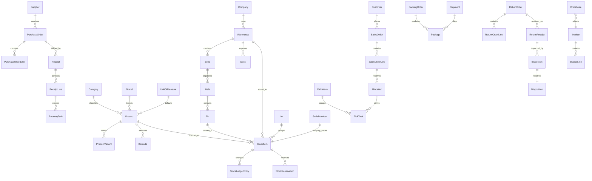
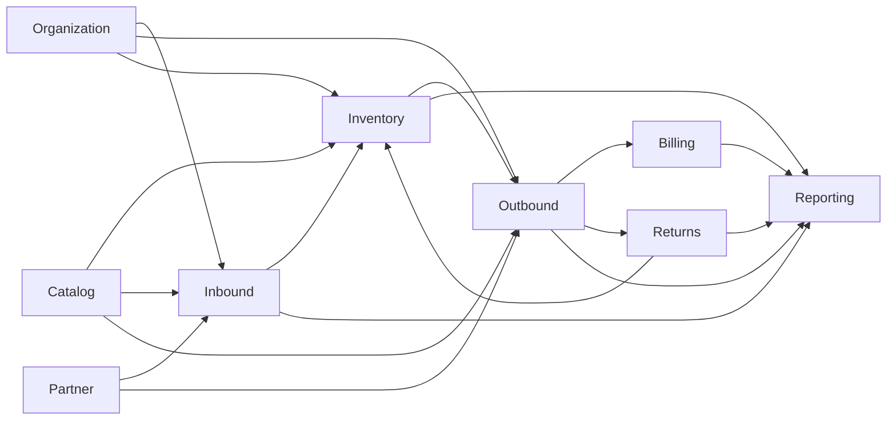

# Warehouse Domain Model

This document defines the bounded contexts, core entities, and high-level relationships for warehouse management in iKho. It is intentionally logical rather than physical. The goal is to make ownership clear before service databases and implementation slices are created.

## Bounded Contexts

The warehouse domain is split into capability-based bounded contexts.

| Bounded Context | Proposed Service | Primary Purpose |
|---|---|---|
| Organization | `Ikho.WarehouseOrganization` | Physical operating structure and location hierarchy |
| Catalog | `Ikho.WarehouseCatalog` | Product master data and classification |
| Partner | `Ikho.WarehousePartner` | Suppliers, customers, and their contact model |
| Inventory | `Ikho.WarehouseInventory` | Stock truth and quantity state |
| Inbound | `Ikho.WarehouseInbound` | Receiving workflow and putaway initiation |
| Outbound | `Ikho.WarehouseOutbound` | Fulfillment workflow and shipping |
| Returns | `Ikho.WarehouseReturns` | Reverse logistics and disposition |
| Billing | `Ikho.WarehouseBilling` | Financial documents derived from warehouse operations |
| Reporting | `Ikho.WarehouseReporting` | Cross-service read models and analytics |

## Domain Principles

1. Product master data does not belong in Inventory.
2. Stock truth does not belong in Inbound or Outbound.
3. Location hierarchy belongs to Organization and is referenced elsewhere by ID.
4. Suppliers and customers belong to Partner even when referenced in orders.
5. Returns and Billing consume operational facts but should not rewrite upstream operational history.

## Core Aggregates By Context

### Organization

- `Company`
- `Warehouse`
- `Zone`
- `Aisle`
- `Bin`
- `Dock`

Key invariants:

1. A warehouse belongs to exactly one company.
2. A bin belongs to exactly one warehouse location tree.
3. Location activation status is centrally managed here.

### Catalog

- `Product`
- `Category`
- `Brand`
- `UnitOfMeasure`
- `ProductVariant`
- `ProductAttributeDefinition`
- `ProductAttributeValue`
- `Barcode`

Key invariants:

1. A product owns its barcode and variant definitions.
2. Product classification is managed through category and brand references.
3. Tracking strategy flags such as lot-controlled or serial-controlled should be published from Catalog and consumed by Inventory.

### Partner

- `Supplier`
- `SupplierAddress`
- `Customer`
- `CustomerAddress`
- `Contact`

Key invariants:

1. Partner identity is distinct from operational orders.
2. Address and contact lifecycle stays inside Partner.

### Inventory

- `StockItem`
- `StockBalance`
- `StockLedgerEntry`
- `Lot`
- `SerialNumber`
- `StockReservation`
- `InventoryAdjustment`
- `CycleCount`
- `CycleCountLine`

Key invariants:

1. On-hand, available, reserved, damaged, and quarantine quantities are derived from Inventory rules.
2. Every quantity-changing operation must produce ledger history.
3. Lot and serial tracking semantics are enforced here based on product policy.

### Inbound

- `PurchaseOrder`
- `PurchaseOrderLine`
- `AdvancedShippingNotice`
- `Receipt`
- `ReceiptLine`
- `PutawayTask`

Key invariants:

1. Receipt cannot exceed inbound business rules without explicit exception workflow.
2. Putaway tasks are created from received but not yet stored inventory.

### Outbound

- `SalesOrder`
- `SalesOrderLine`
- `Allocation`
- `PickWave`
- `PickTask`
- `PackingOrder`
- `Package`
- `Shipment`

Key invariants:

1. Allocation reflects a claim on available stock, not ownership of stock truth.
2. Shipment status depends on operational milestones, not direct stock mutation outside Inventory commands.

### Returns

- `ReturnOrder`
- `ReturnOrderLine`
- `ReturnReceipt`
- `Inspection`
- `Disposition`

Key invariants:

1. Returned stock requires an inspection and disposition path before it becomes sellable again.
2. Disposition outcomes may restock, quarantine, scrap, or trigger vendor return processes.

### Billing

- `Invoice`
- `InvoiceLine`
- `CreditNote`
- `Payment`

Key invariants:

1. Billing uses operational snapshots rather than live joins back into warehouse transaction services.
2. Once issued, financial documents should preserve the captured commercial facts.

### Reporting

- `InventoryPositionReadModel`
- `InboundStatusReadModel`
- `OutboundStatusReadModel`
- `FulfillmentKpiReadModel`

Key invariants:

1. Reporting data is rebuildable from source events.
2. Reporting is optimized for querying, not transactional consistency.

## High-Level Relationships

## Cross-Context Dependency Map

Interpretation of this map:

1. Organization, Catalog, and Partner provide reference data to operational services.
2. Inventory is the stock system of record and is depended on by both Inbound and Outbound.
3. Returns feeds Inventory after disposition decisions are complete.
4. Reporting consumes events from all operational services.

## Aggregate Boundaries And Interaction Rules

1. `Product` is modified only by Catalog.
2. `StockBalance` and `StockLedgerEntry` are modified only by Inventory.
3. `PurchaseOrder` and `Receipt` are modified only by Inbound.
4. `SalesOrder`, `Allocation`, and `Shipment` are modified only by Outbound.
5. `ReturnOrder` and `Disposition` are modified only by Returns.
6. `Invoice` and `CreditNote` are modified only by Billing.

When another context needs related data, it must choose one of these patterns:

1. Store the owning entity ID only.
2. Store the ID plus a denormalized display snapshot.
3. Query the owning service through an API.
4. Subscribe to events and maintain a local read projection.

## Entity Identity Guidance

Each aggregate should expose a service-local primary key and one stable public identifier suitable for cross-service references.

Suggested public identifiers:

1. `CompanyId`, `WarehouseId`, `BinId`
2. `ProductId`, `Sku`
3. `SupplierId`, `CustomerId`
4. `LotId`, `SerialNumberId`
5. `PurchaseOrderId`, `ReceiptId`
6. `SalesOrderId`, `ShipmentId`
7. `ReturnOrderId`, `InvoiceId`

## Related Documents

1. [warehouse-db-relationships.md](./warehouse-db-relationships.md)
2. [../plans/warehouse-microservices-rollout-plan.md](../plans/warehouse-microservices-rollout-plan.md)
3. [../../source/libs/ikho-schema-management/README.md](../../source/libs/ikho-schema-management/README.md)
