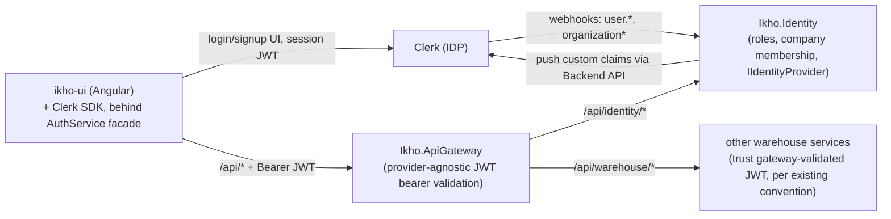

# Ikho.Identity — Provider-Swappable Authentication Service

Fills the `Identity / Access` bounded context flagged in
[warehouse-microservices-rollout-plan.md](../../plans/warehouse-microservices-rollout-plan.md)
(`Ikho.Identity` — "Users, roles, authentication, authorization" — previously listed as
"Existing / separate concern," not yet built) and the open questions in
[api-gateway.md](../../architecture/api-gateway.md#open-questions) around the gateway's
placeholder `Jwt:Authority`/`Jwt:Audience` values.

## Context

The API Gateway (`Ikho.ApiGateway`) already has JWT bearer authentication scaffolding
(`Shared/Authentication/JwtAuthenticationExtensions.cs`) wired into its pipeline, but
`Jwt:Authority`/`Jwt:Audience` are blank placeholders — no identity provider has been chosen
and no route requires an authenticated principal yet. `ikho-ui` has no login/signup UI, no
route guards, and no session state; role distinctions in the frontend (Office vs Operator)
currently come from static mock data, not real authorization.

iKho's domain already has a multi-tenant concept: `Company` owns `Warehouse`s (see
[warehouse-domain-model.md](../../architecture/warehouse-domain-model.md)). This design uses
**Clerk** as the initial identity provider, with **Clerk Organizations mapping 1:1 to iKho
`Company`**, while keeping every Clerk-specific detail behind a single interface so a future
provider swap (Entra ID, Auth0, custom) touches one adapter class and gateway config — not
domain logic, not the database schema, not the frontend beyond one facade service.

## Goals

- Stand up `Ikho.Identity` as a real backend service (its own DB, own port, following the
  standard [warehouse-service-template](../../architecture/warehouse-service-template.md))
  that owns iKho-specific roles, permissions, and company membership — independent of
  whatever identity provider issues login sessions.
- Wire Clerk in as the first provider: login/signup in `ikho-ui`, JWT validation at the
  gateway, webhook-driven sync of users/org membership into `Ikho.Identity`, and role/company
  claims pushed back into Clerk session tokens so downstream services can authorize requests
  without an extra network hop per call.
- Make the provider swappable: isolate all Clerk-specific code behind an `IIdentityProvider`
  interface in the backend and a single `AuthService` facade in the frontend.

## Non-goals

- Fine-grained permission tables beyond `Role` (`Office`, `Operator`) — the UI only
  distinguishes these two today; a `Permissions` table can be added later without changing
  this design's shape.
- Using Clerk's built-in org-role feature for iKho roles — iKho roles are modeled and owned
  entirely in `Ikho.Identity`'s own tables, decoupled from Clerk's role feature set.
- Per-service JWT re-validation for warehouse services other than `Ikho.Identity` — every
  other `Ikho.Warehouse*` service continues to trust gateway-level authentication, per the
  existing convention in warehouse-service-template.md (`Jwt`/`Cors`/`RateLimiting` sections
  are "not required per service"). `Ikho.Identity` is the one exception because its
  role-assignment endpoints need real per-request authorization.
- Building a company/warehouse invite UI beyond what Clerk's org invite flow already provides.

## Architecture



- `Ikho.Identity` joins `source/apps/` at port `5160` (next after Reporting's `5159`), routed
  at `/api/identity/*`, following the same Vertical Slice Architecture and
  `Ikho.SharedLibrary` bootstrap as every other warehouse service.
- The gateway's existing `JwtAuthenticationExtensions.cs` is moved into
  `ikho-shared-library` as a generic `AddJwtBearerAuthentication(configuration)` extension
  (it was already provider-agnostic — just config-driven `Authority`/`Audience`/JWT-bearer
  registration). Both the gateway and `Ikho.Identity` call the same extension off the same
  `Jwt:Authority`/`Jwt:Audience` config shape, so there is exactly one place that knows how to
  validate a JWT, regardless of provider.
- All Clerk-specific code (webhook signature verification, payload parsing, Backend API calls
  to push claims) lives behind `IIdentityProvider` inside `Ikho.Identity`. All Clerk-specific
  frontend code lives behind an `AuthService` facade inside `ikho-ui`.

## Data model (`Ikho.Identity`, Postgres, owned solely by this service)

| Table | Purpose |
|---|---|
| `Users` | Mirror of Clerk users: `Id` (iKho GUID), `ExternalUserId` (Clerk user ID), `Email`, `DisplayName`, `CreatedAtUtc` |
| `CompanyMemberships` | `UserId`, `CompanyId` (iKho), `ExternalOrgId` (Clerk org ID), `Status` (`Active`/`Invited`/`Removed`) |
| `Roles` | iKho-defined roles, seeded: `Office`, `Operator` |
| `RoleAssignments` | `UserId`, `CompanyId`, `WarehouseId` (nullable — null means company-wide), `RoleId` |
| `OutboxMessages` / `ProcessedMessages` | Standard shared-library outbox/idempotency tables |

`CompanyId`/`WarehouseId` are referenced by ID only (per the architecture's no-cross-database-FK
rule) — validated via a synchronous lookup to `Ikho.Warehouse.Organization` at write time when
a `RoleAssignment` is created.

## Provider abstraction

```csharp
public interface IIdentityProvider
{
    Task<IdentityWebhookEvent> ParseWebhookAsync(HttpRequest request, CancellationToken ct);
    Task PushUserClaimsAsync(string externalUserId, UserClaimsPayload claims, CancellationToken ct);
}
```

- `IdentityWebhookEvent` is a canonical model (`UserCreated`, `UserUpdated`,
  `OrganizationMembershipCreated`, `OrganizationMembershipRemoved`, ...). Feature slices
  (`Features/Webhooks/`, `Features/RoleAssignment/`) only ever handle this canonical shape —
  never a raw Clerk payload.
- `ClerkIdentityProvider` is the only class that imports a Clerk SDK/HTTP client. It verifies
  svix webhook signatures and translates Clerk payloads into `IdentityWebhookEvent`, and calls
  Clerk's Backend API to update `publicMetadata` (which a Clerk JWT template projects into
  session token claims) for `PushUserClaimsAsync`.
- Registered as `services.AddSingleton<IIdentityProvider, ClerkIdentityProvider>()` in
  `Program.cs`. A future provider swap replaces this one line plus a new adapter class —
  `Features/`, `Domain/`, and the DB schema are untouched.

## Sync flow (reuses existing outbox/Kafka/idempotency infrastructure — no new infra)

**Inbound (Clerk → Ikho.Identity):**

1. Clerk calls `POST /api/identity/webhooks/clerk`.
2. `ClerkIdentityProvider.ParseWebhookAsync` verifies the svix signature and returns an
   `IdentityWebhookEvent`. Invalid signature → `400`, no DB mutation.
3. Duplicate deliveries (Clerk retries) are deduped via `IIdempotencyStore`, keyed on the
   webhook event ID — the same mechanism already used for Kafka consumers elsewhere in this
   repo. Unrecognized event types are acked (`200`) with a logged warning, to stop Clerk
   retrying them.
4. The webhook feature slice applies the event to `Users`/`CompanyMemberships` in the same
   transaction as an outbox row (`UserClaimsSyncRequested { UserId }`, via `IOutboxWriter`) —
   e.g. a new `organizationMembership.created` upserts a `CompanyMembership` defaulting to the
   `Operator` role, and enqueues a claims sync for that user.

**Outbound (role/membership change → Clerk claims):**

1. Any change to `RoleAssignments` or `CompanyMemberships` — from the webhook flow above, or
   from an admin-facing `Features/RoleAssignment/` endpoint gated by
   `[Authorize(Policy = "CompanyAdmin")]` — enqueues `UserClaimsSyncRequested` in the same DB
   transaction as the change.
2. `OutboxPublisherBackgroundService<IdentityDbContext>` (already provided by
   `AddServiceDefaults`) publishes it to Kafka — no new publisher code.
3. A `ClaimsSyncConsumer` background service inside `Ikho.Identity` subscribes to that topic,
   dedupes via `IIdempotencyStore`, loads the user's current roles/memberships, and calls
   `IIdentityProvider.PushUserClaimsAsync`. Failures rely on standard Kafka at-least-once
   redelivery — no bespoke retry loop.

A role change is never lost (durably queued in the same transaction as the write) and every
claims sync has an audit trail (outbox history), using infrastructure this repo already has.

## Gateway & downstream services

- Gateway `Jwt:Authority` becomes Clerk's issuer URL (JWKS-discoverable); `Jwt:Audience` is
  set per Clerk's JWT template. No Clerk-specific code in the gateway.
- Every other `Ikho.Warehouse*` service continues to trust gateway-level authentication
  unchanged (existing convention). `Ikho.Identity` is the exception: it registers the same
  shared `AddJwtBearerAuthentication` extension so its role-assignment endpoints can enforce
  `[Authorize]` policies against the caller's own claims (e.g. "is this user a `CompanyAdmin`
  of the company they're modifying").

## Frontend (`ikho-ui`)

- All Clerk SDK usage isolated behind a single `AuthService` facade in
  `src/app/core/auth/` — nothing else in the app imports Clerk types directly. Exposes
  signals: `isSignedIn()`, `currentUser()`, `activeCompany()`, `roles()`, `getToken()`.
- New lazy-loaded `src/app/features/auth/` module with `/login` and `/signup` routes
  rendering Clerk's sign-in/sign-up UI.
- `authInterceptor` attaches `Authorization: Bearer <token>` (from `AuthService.getToken()`)
  to every `/api/*` call; on a `401` it refreshes the token once via Clerk's SDK and retries.
- A functional `authGuard` protects routes, redirecting to `/login` when signed out; a
  `roleGuard` reads `AuthService.roles()` to gate Office vs Operator routes, replacing today's
  mock-data role stubs in `office-shell`.
- A company switcher appears in the shell header when `activeCompany()` has alternatives,
  backed by Clerk's native multi-org support (a user can have multiple `CompanyMemberships`).

## Error handling

| Scenario | Behavior |
|---|---|
| Invalid webhook signature | `400`, no DB mutation, no outbox row |
| Duplicate webhook delivery | Deduped via `IIdempotencyStore` on webhook event ID |
| Unrecognized webhook event type | `200` ack + logged warning, no-op |
| Outbox → Kafka publish failure | Existing outbox retry/error tracking (`RetryCount`/`Error`) |
| `ClaimsSyncConsumer` → Clerk API failure | Standard Kafka at-least-once redelivery |
| Expired token at gateway | `401`; frontend interceptor refreshes token once and retries |
| Non-admin calls role-assignment endpoint | `403` via `[Authorize(Policy = "CompanyAdmin")]` |
| `RoleAssignment` references nonexistent `Company`/`Warehouse` | `422`, validated via sync lookup to `Ikho.Warehouse.Organization` at write time |

## Testing

- `Ikho.Identity`: xUnit + `WebApplicationFactory<Program>`. A `FakeIdentityProvider`
  implementing `IIdentityProvider` means integration tests (webhook processing, role
  assignment, claims-sync triggering) never call real Clerk.
- A narrow unit-test suite for `ClerkIdentityProvider` itself, using recorded sample Clerk
  webhook payloads and known svix signatures — the only tests that know Clerk's wire format.
- Gateway: existing-style JWT bearer tests against a local test JWKS (`401` without token,
  `200` with a valid token, `401` with an expired/invalid signature).
- Frontend: `AuthService` unit-tested with the Clerk SDK mocked; `authInterceptor` and route
  guards tested directly against `AuthService`'s signals, no real Clerk calls in the vitest
  suite.

## Open questions

1. Which Clerk plan/tier is available, and does it support JWT template custom claims and
   organization webhooks on that tier?
2. Exact set of Clerk webhook events to subscribe to beyond `user.created`/`updated`,
   `organizationMembership.created`/`deleted` — TBD once Clerk's dashboard is configured.
3. Whether `Ikho.Identity` needs its own database migration/seed step for default `Roles`
   rows (`Office`, `Operator`) as part of first deployment, or whether that's handled by a
   startup seeding step like other services use.
